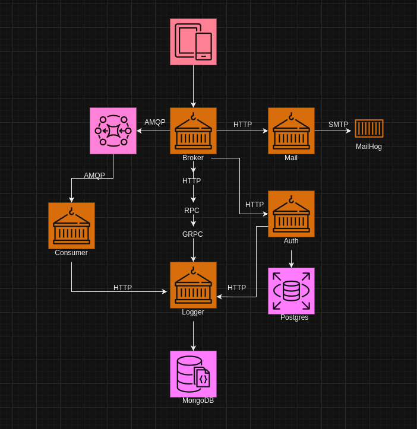

# 🚀 My First Go Microservice Project 🚀

Welcome to my first Go microservice project! 🎉 In this project, I've explored a variety of modern technologies, communication patterns, and both SQL and NoSQL databases. 💻📡🗄️ I've also built a lightweight frontend to test the networking between all these microservices. 🌐🧪

## 🛠️ Technologies and Patterns 🛠️

In this project, I've used:

- Go for the backend microservices 🚀
- Both SQL and NoSQL databases 🗄️
- Various communication patterns for microservices 🔗
- Different Networking Protocols 🔌
- A lightweight frontend for testing 🌐

I've focused on understanding and implementing concepts like coupling and decoupling in the context of microservices. 🔗

## 🖼️ Project Image 🖼️

Here's a visual representation of the project:

📺 Watch the given video link for a video demonstration on how this works!

Stay tuned for more updates as I continue to learn and grow my skills in microservices with Go! 🌱🚀
